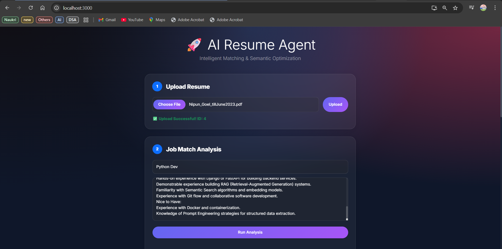
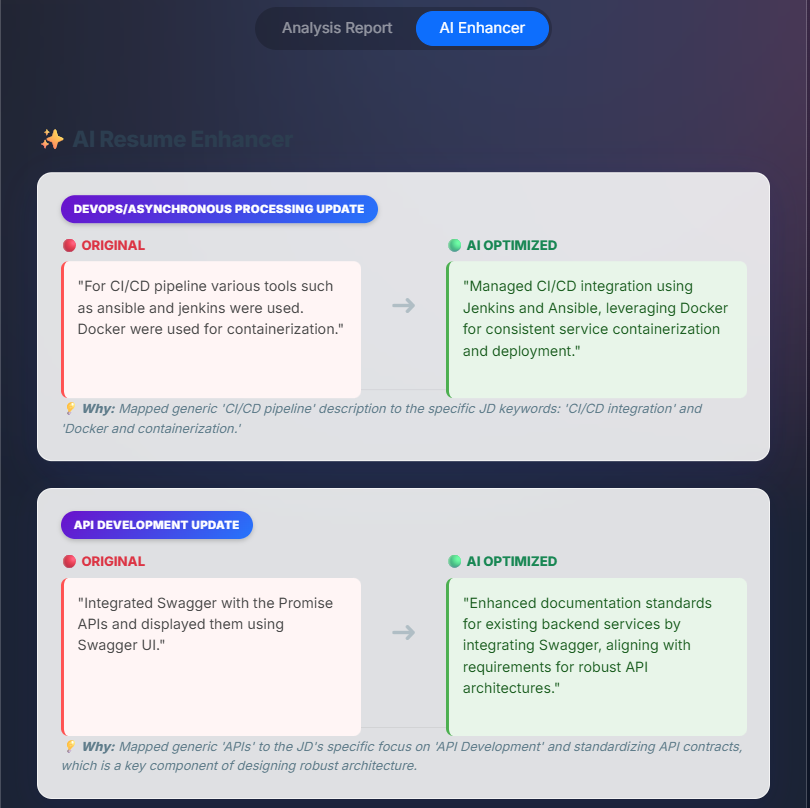

# 💎 Prism AI (formerly Resume Analyzer)

### *Intelligent Career Alignment Agent*

A Semantic AI Agent that doesn't just "read" resumes—it **optimizes** them.
Using **Google Gemini 1.5 Pro**, **Vector Embeddings (RAG)**, and **Agentic Workflows**, Prism AI analyzes your resume against a target JD and **rewrites your bullet points** to match the industry terminology of the company.

---

### ✨ New "Liquid Glass" Dashboard

*(Paste your Main Dashboard/Upload Screenshot here)*
``

---

## 🌟 Key Features

### 🧠 1. Semantic Analysis Agent

* **Beyond Keywords:** Uses Vector Search (ChromaDB) to understand the *meaning* of your skills, not just exact text matches.
* **Deep Reasoning:** The AI provides a "Verdict" explaining *why* you are (or aren't) a good fit.

### ⚡ 2. The "Optimizer" Agent (New!)

* **Active Rewriting:** It doesn't just give feedback; it **rewrites your resume** for you.
* **Terminology Mapping:** Automatically maps your generic skills (e.g., "Fixed bugs") to specific JD terms (e.g., "Root Cause Analysis").
* **Side-by-Side Diff:** See the "Original" vs. "AI Optimized" version in a clean comparison view.

*(Paste your Side-by-Side Optimization Screenshot here)*
``

### 🎨 3. Modern "Liquid Glass" UI

* **Glassmorphism Design:** Features a mesh-gradient background with frosted glass cards.
* **Interactive Elements:** Smooth transitions, dynamic badges, and a "Dark Mode" native aesthetic.

---

## 🛠️ Tech Stack

* **Brain:** Google Gemini 1.5 Flash (via Google Gen AI SDK)
* **Memory:** ChromaDB (Vector Store for RAG)
* **Backend:** Django REST Framework (Python)
* **Frontend:** React.js + Custom "Liquid Glass" CSS
* **Orchestration:** Celery + Redis (Asynchronous Agent Queues)

---

## 🚀 How to Run

### Prerequisites

* Python 3.10+
* Node.js
* Redis Server (Running locally)
* Google Gemini API Key

### 1. Backend Setup

```bash
# Clone and Enter
git clone https://github.com/amohammedhayath/prism-ai.git
cd AI_Agent_Powered_Resume_Analyzer

# Virtual Env
python -m venv .venv
source .venv/bin/activate  # or .venv\Scripts\activate on Windows

# Install Dependencies
pip install -r requirements.txt

# Setup Environment Variables (Create a .env file or export)
export GEMINI_API_KEY="your_api_key_here"

# Migrations
python manage.py migrate

# Start Redis Worker (Terminal 1)
celery -A AI_Agent_Powered_Resume_Analyzer worker --loglevel=info --pool=solo

# Start Django Server (Terminal 2)
python manage.py runserver

```

### 2. Frontend Setup

```bash
cd resume-ai-frontend

# Install Node Modules
npm install

# Start React App
npm start

```

---

## 📸 Screen Gallery

**1. The "Liquid Glass" Dashboard**
*A modern, dark-themed upload interface using glassmorphism design.*


**2. The Analysis Report**
*Deep semantic analysis of the resume vs. the job description with a fitment score.*


**3. The AI Optimizer**
*Side-by-side comparison showing how the AI rewrites bullet points to match the JD.*


---

## 🔮 Future Roadmap

* [ ] **Interview Agent:** Generates tech-stack specific questions based on the gaps found.
* [ ] **PDF Export:** Download the "Optimized Resume" directly as a new PDF.
* [ ] **LinkedIn Scraper:** Auto-fetch JDs from LinkedIn URLs.

---

**Star ⭐ this repo if you like it!**
